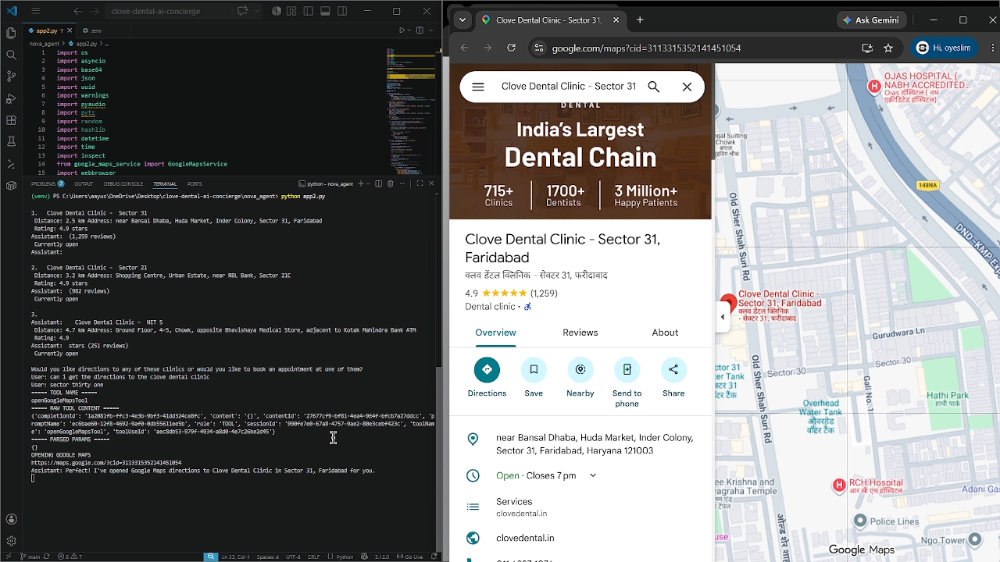
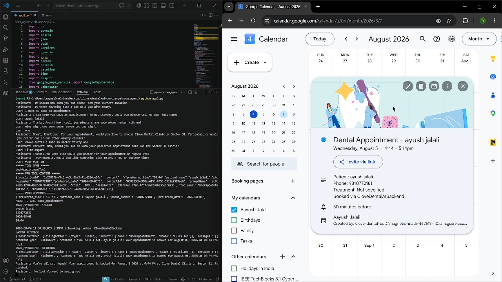
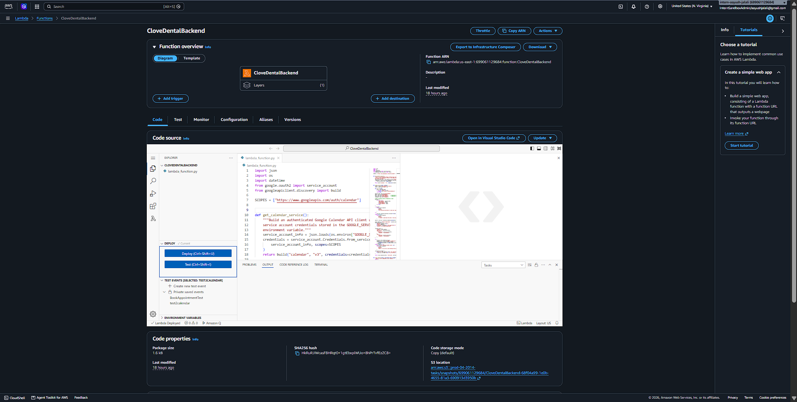
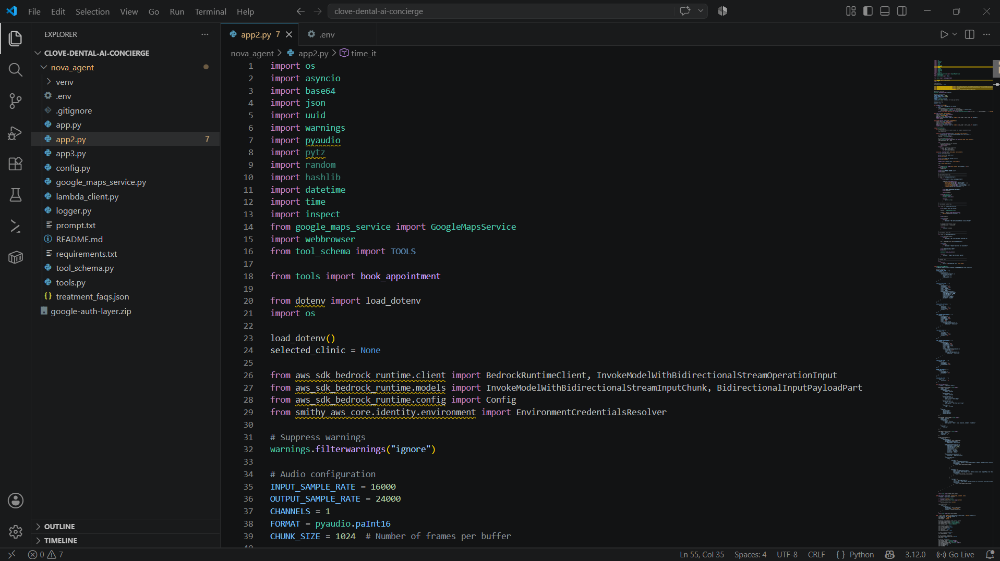

# 🦷 Clove Dental AI Voice Concierge

An AI-powered voice concierge built using **Amazon Nova Sonic** on **Amazon Bedrock Runtime**. The assistant enables natural speech-to-speech conversations, helps users locate nearby Clove Dental clinics using Google Maps, and books dental appointments through AWS Lambda with automatic Google Calendar integration.

---

## 📖 Project Overview

The Clove Dental AI Voice Concierge demonstrates how Generative AI can be used to build an intelligent healthcare voice assistant capable of performing real-world tasks through natural voice conversations.

Using Amazon Nova Sonic, the assistant understands spoken requests, determines whether an external action is required, invokes the appropriate tool, and responds naturally to the user.

Current capabilities include:

- Finding nearby Clove Dental clinics
- Opening Google Maps directions
- Booking appointments
- Automatically creating Google Calendar events

---

# ✨ Features

- 🎙️ Real-time AI voice conversations using Amazon Nova Sonic
- 📍 Search nearby Clove Dental clinics
- 🗺️ Open Google Maps directions
- 📅 Book dental appointments
- 📆 Automatically create Google Calendar events
- ⚡ AWS Lambda powered appointment backend
- 🔧 Modular tool-calling architecture

---

# 🏗️ System Architecture

> *(Insert the architecture diagram here once created.)*

<p align="center">
  
</p>

---

# 🛠️ Tech Stack

| Category | Technology |
|----------|------------|
| Programming Language | Python 3.12 |
| AI Model | Amazon Nova Sonic |
| AI Runtime | Amazon Bedrock Runtime |
| Cloud Services | AWS Lambda |
| APIs | Google Maps API, Google Calendar API |
| Audio | PyAudio |
| Environment Management | python-dotenv |
| Async Processing | asyncio |

---

# 📂 Project Structure

```text
clove-dental-ai-concierge/
│
├── README.md
├── google-auth-layer.zip
│
├── screenshots/
│   ├── voice-based-clinic-search.png
│   ├── appointment-booking-google-calendar.png
│   ├── aws-lambda-backend.png
│   └── project-structure.png
│
├── docs/
│   ├── architecture.png
│   └── technical-documentation.pdf
│
└── nova_agent/
    ├── app.py
    ├── app2.py
    ├── app3.py
    ├── config.py
    ├── google_maps_service.py
    ├── lambda_client.py
    ├── logger.py
    ├── prompt.txt
    ├── requirements.txt
    ├── tool_schema.py
    ├── tools.py
    ├── treatment_faqs.json
    ├── .gitignore
    ├── .env (create locally)
    └── venv/
```

---

# 🚀 Deployment & Setup

## 1. Clone the Repository

```bash
git clone https://github.com/<your-github-username>/clove-dental-ai-concierge.git

cd clove-dental-ai-concierge/nova_agent
```

---

## 2. Create a Virtual Environment

### Windows

```bash
python -m venv venv

venv\Scripts\activate
```

### Linux / macOS

```bash
python3 -m venv venv

source venv/bin/activate
```

---

## 3. Install Dependencies

```bash
pip install -r requirements.txt
```

---

## 4. Create a `.env` File

The repository intentionally does **not** include a `.env` file to protect sensitive credentials.

Create a new file named:

```text
.env
```

inside the `nova_agent` directory.

Add the required environment variables.

Example:

```env
AWS_REGION=<your-region>

AWS_ACCESS_KEY_ID=<your-access-key>

AWS_SECRET_ACCESS_KEY=<your-secret-key>

GOOGLE_MAPS_API_KEY=<your-google-maps-api-key>

# Add any additional variables required by the project
```

> ⚠️ Never commit your `.env` file to GitHub.

---

## 5. Configure AWS

Before running the application:

- Enable access to **Amazon Nova Sonic** in Amazon Bedrock.
- Configure your AWS credentials.
- Deploy the AWS Lambda function.
- Configure the required IAM permissions.
- Update any required environment variables.

---

## 6. Configure Google APIs

Create a Google Cloud project and enable:

- Google Maps API
- Google Calendar API

Generate the required credentials and configure them in the application and Lambda function.

---

## 7. Run the Application

Run the desired application entry point.

Example:

```bash
python app2.py
```

> Replace `app2.py` with the final application entry point if required.

---

## 📸 Project Demonstration

### 1. Voice-Based Clinic Search with Google Maps Integration

<p align="center">

</p>

---

### 2. AI-Powered Appointment Booking with Google Calendar Integration

<p align="center">

</p>

---

### 3. AWS Lambda Backend for Appointment Management

<p align="center">

</p>

---

### 4. Project Structure and Amazon Nova Sonic Integration

<p align="center">

</p>

---


# 🔄 How It Works

1. The user speaks to the AI assistant.
2. Audio is streamed to Amazon Nova Sonic through Amazon Bedrock Runtime.
3. The model understands the user's intent.
4. If an external action is required, the assistant invokes the appropriate tool.
5. Tool responses are returned to the model.
6. Amazon Nova Sonic generates a natural voice response for the user.

---

# 🔧 Future Improvements

- Support additional Indian languages
- Real-time appointment availability
- Appointment rescheduling and cancellation
- Patient authentication
- Persistent conversation memory
- CloudWatch monitoring dashboards
- Docker containerization
- CI/CD pipeline for automated deployment
- Integration with additional healthcare services

---

# 👨‍💻 Author

**Aayush Jalali**
